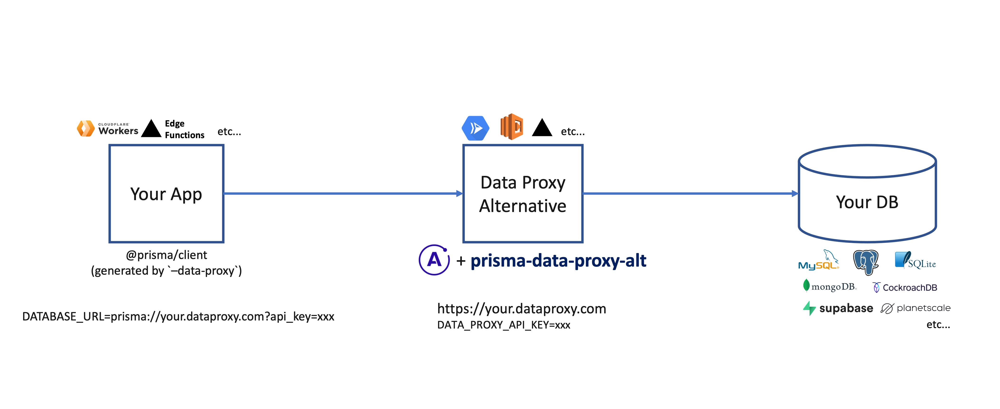
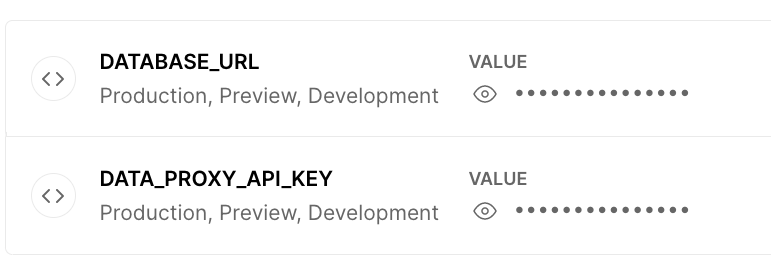

[](https://badge.fury.io/js/prisma-data-proxy-alt)
[](https://codecov.io/gh/aiji42/prisma-data-proxy-alt)
[](https://github.com/aiji42/prisma-data-proxy-alt/actions/workflows/ci.yml)

# Alternative Prisma Data Proxy

This is a library to alternate and self-host the [Prisma Data Proxy (cloud.prisma.io)](https://www.prisma.io/docs/concepts/data-platform/data-proxy).

In order to deploy your project to edge runtimes (such as Cloudflare Workers or Vercel Edge Functions) and use Prisma, you will need to use the Prisma Data Proxy.  
However, at present, instances can only be built in limited areas, and there are also delays caused by cold standby. This is a very stressful problem.

Therefore, we have created a server library to replace Prisma Data Proxy. With it, you are free from stressful limitations.
You can deploy it on any platform in any region you like and use any data source you like, such as Supabase or Planetscale.

No changes are required to your prisma client code, just set the `DATABASE_URL` to the URL you self-hosted with this library.  
This is not an official library, but it works the same as Prisma Data Proxy.

## Overview



### Performance

Using the Alternative Prisma Data Proxy, a significant reduction in clause latency can be expected regardless of the region of the instance.
See [here](./docs/BENCHMARK.md) for details.

## Setup

If you are using `@prsima/client` v3, install `prisma-data-proxy-alt@^1`.  
The latest library (v2) suports only `@prima/client` v4.

```bash
yarn add prisma-data-proxy-alt
```

Include prisma schema in your project. **The same schema as the client**.  

```bash
cp your_client_project_path/prisma/schema.prisma ./prisma/schema.prisma
```

Install `prisma` and `@prisma/client`.
```bash
yarn add -D prisma
yarn add @prisma/client
```

## Launch proxy server

Give environment variables by creating `.env`, etc.
```
PRISMA_SCHEMA_PATH=/absolute/path/for/your/schema.prisma
DATABASE_URL={database URL scheme e.g. postgresql://postgres:pass@db:5432/postgres?schema=public}
DATA_PROXY_API_KEY={random string for authentication}
PORT={server port e.g. 3000}
```

```bash
yarn pdp
```

This will bring up the proxy server, but it must be SSL-enabled to connect from `@prisma/client`.  
So here are the steps to establish a local connection with SSL using docker-compose and `https-portal` with a self certificate.

Create `entrypoint.sh`.
```sh
#!/bin/sh

yarn install
exec "$@"
```

Create `docker-compose.yml`.
```yaml
version: '3'

services:
  data-proxy:
    image: node:18-bullseye-slim
    working_dir: /app
    ports:
      - "3000:3000"
    entrypoint: /app/entrypoint.sh
    command: yarn pdp
    environment:
      PRISMA_SCHEMA_PATH=/app/path/your/schema.prisma
      DATABASE_URL: your DATABASE_URL
      DATA_PROXY_API_KEY: your DATA_PROXY_API_KEY
      PORT: "3000"
    volumes:
      - ./:/app:cached
      - node_modules:/app/node_modules
  https-portal:
    image: steveltn/https-portal:1
    ports:
      - "443:443"
    environment:
      STAGE: local
      DOMAINS: 'localhost -> http://data-proxy:3000'
    volumes:
      - ./ssl-certs:/var/lib/https-portal

volumes:
  node_modules:
```

```bash
docker-compose up
```

Now you can connect with data proxy with `DATABASE_URL=prisma://localhost?api_key={DATA_PROXY_API_KEY}`.

## Deploy 

### GCP Cloud Run

Create `Dockerfile`

```dockerfile
FROM node:16.15-bullseye-slim as base

RUN apt-get update && apt-get install -y tini ca-certificates \
  && apt-get clean \
  && rm -rf /var/lib/apt/lists/*

WORKDIR /app

FROM base as builder

COPY package.json .
COPY yarn.lock .
COPY prisma/schema.prisma ./prisma/schema.prisma

RUN yarn install

RUN yarn prisma generate

FROM base

COPY --from=builder /app/node_modules ./node_modules
COPY --from=builder /app/package.json ./package.json
COPY --from=builder /app/prisma/schema.prisma ./prisma/schema.prisma

ENV PRISMA_SCHEMA_PATH=/app/prisma/schema.prisma

USER node

ENTRYPOINT ["/usr/bin/tini", "--"]
CMD ["yarn", "pdp"]
```

Create `cloudbuild.yml`

```yml
steps:
  - name: 'gcr.io/kaniko-project/executor:latest'
    args:
      - --destination=gcr.io/$PROJECT_ID/prisma-data-proxy-alt:$SHORT_SHA
      - --destination=gcr.io/$PROJECT_ID/prisma-data-proxy-alt:latest
      - --cache=true
  - name: 'gcr.io/google.com/cloudsdktool/cloud-sdk'
    entrypoint: gcloud
    args:
      - run
      - deploy
      - prisma-data-proxy-alt
      - --image
      - gcr.io/$PROJECT_ID/prisma-data-proxy-alt:latest
      - --region
      - $_REGION
      - --allow-unauthenticated
      - --set-env-vars
      - DATABASE_URL=$_DATABASE_URL
      - --set-env-vars
      - DATA_PROXY_API_KEY=$_DATA_PROXY_API_KEY
substitutions:
  _REGION: asia-northeast1
  _DATABASE_URL: your_database_url
  _DATA_PROXY_API_KEY: your_api_key
```

Create a new trigger from the GCP Cloud Build web console and link it to your repository.  

Set `_REGION`, `_DATABASE_URL`, and `_DATA_PROXY_API_KEY` in the substitution values.


- `_REGION`: The region of deploy target for Cloud Run
- `_DATABASE_URL`: Connection URL to your data source (mysql, postgres, etc...)
- `_DATA_PROXY_API_KEY`: Arbitrary string to be used when connecting data proxy. e.g. `prisma://your.deployed.domain?api_key={DATA_PROXY_API_KEY}`  
  (do not divulge it to outside parties)

### Vercel

Create `api/index.js`

```js
exports.default = require("prisma-data-proxy-alt/dist/server").default;
```

Set `postinstall` in the scripts of `package.json`.

```json
  "scripts": {
    "postinstall": "prisma generate"
  },
```

Create `vercel.json`

```json
{
  "version": 2,
  "routes": [
    {
      "src": "/.*",
      "dest": "/api/index.js"
    }
  ]
}
```

Open the Vercel web console and link the repository to the project.
Then set the `DATABASE_URL` and `DATA_PROXY_API_KEY` as environment variables and deploy.



- `PRISMA_SCHEMA_PATH`: TODO
- `DATABASE_URL`: Connection URL to your data source (mysql, postgres, etc...)
- `DATA_PROXY_API_KEY`: Arbitrary string to be used when connecting data proxy. e.g. `prisma://your.deployed.domain?api_key={DATA_PROXY_API_KEY}`  
  (do not divulge it to outside parties)

## For Client (on your application)

On the client side, generate the Prisma client in data proxy mode `--data-proxy`. [official document](https://www.prisma.io/docs/concepts/data-platform/data-proxy#step-4-generate-the-client)
```bash
yarn prisma generate --data-proxy
```

Set the `DATABSE_URL` from the domain of the server you deployed and the api key (`DATA_PROXY_API_KEY`) you set for it.
```
DATABSE_URL=prisma://${YOUR_DEPLOYED_PROJECT_DOMAIN}?api_key=${DATA_PROXY_API_KEY}
```

**Now you can connect to the (alternative) Data Proxy from your application. 🎉**

## Contribution

Please read [CONTRIBUTING.md](./CONTRIBUTING.md) for details on our code of conduct, and the process for submitting pull requests to us.

## LICENCE

This project is licensed under the MIT License - see the [LICENSE](./LICENSE) file for details
